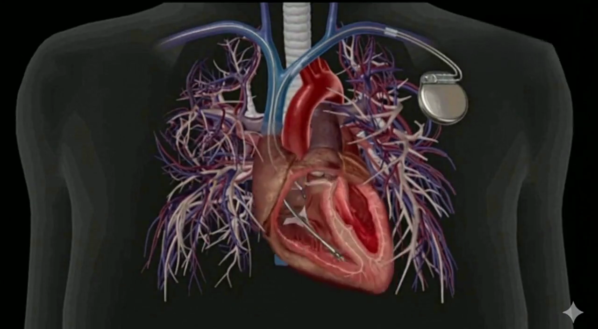

# QRS Pacemaker Simulation

This project implements a comprehensive simulation of a **VVIR Pacemaker** integrated with a real-time **Pan-Tompkins QRS detection algorithm**. It allows for the simulation of cardiac sensing, pacing logic, and rate modulation, accompanied by a rich visualization dashboard.

## 🎯 Project Overview

The system is designed to simulate a closed-loop biomedical device:
1.  **Sensing**: It processes raw ECG signals to detect R-peaks (heartbeats) using a C-optimized implementation of the Pan-Tompkins algorithm.
2.  **Logic**: It implements standard pacemaker timing cycles (NBG Code: **VVIR**):
    *   **V**entricle Paced
    *   **V**entricle Sensed
    *   **I**nhibited Response (resets timer on natural beat)
    *   **R**ate Modulation (adjusts pacing rate based on simulated activity)
3.  **Visualization**: A real-time dashboard plots the ECG trace, pacemaker status (Sensing vs. Pacing), and instantaneous heart rate, synchronized with a video animation of a beating heart.

## 🔬 Methodology

### 1. Pan-Tompkins QRS Detection
The core sensing module relies on the classic Pan-Tompkins algorithm to accurately identify QRS complexes (ventricular depolarization) from the raw ECG signal. The pipeline includes:
*   **Bandpass Filtering**: A combination of low-pass and high-pass filters to isolate coverage to 5-15 Hz, reducing muscle noise and baseline wander.
*   **Differentiation**: Computes the derivative to highlight the steep slope of the QRS complex.
*   **Squaring**: Signal is squared to emphasize higher frequencies (QRS) and reduce false positives from T-waves.
*   **Moving Window Integration**: Integrates the squared signal over a ~150ms window to produce a smooth waveform representing the energy of the QRS.
*   **Adaptive Thresholding**: Automatically adjusts detection thresholds based on signal noise levels to identify R-peaks.

### 2. VVIR Pacemaker Logic
The simulation implements a Single-Chamber Ventricular Pacemaker with Rate Response:
*   **Lower Rate Limit (LRL)**: The baseline minimum heart rate (e.g., 60 BPM).
*   **Timing Cycle**: A counter increments with every sample.
    *   **Inhibition**: If an intrinsic R-peak is detected (Sensed) before the counter expires, the timer resets.
    *   **Pacing**: If the counter reaches the limit corresponding to the LRL, a pacing stimulus is triggered, and the timer resets.
*   **Refractory Periods**: After a sense or pace event, the "eye" of the pacemaker closes (Blanking Period) to avoid sensing the aftershocks of the beat.
*   **Rate Modulation (R)**: The system takes a secondary input (simulated accelerometer data). As "activity" increases, the LRL is dynamically raised to meet metabolic demand, shortening the pacing interval.

## 📊 Results

The simulation visualizes the interplay between the ECG signal, the detection algorithm, and the pacemaker's decision-making in real-time.



*   **Top Left**: Real-time ECG trace with Blue lines (signal) and Red dots (Paced events).
*   **Middle Left**: Current Pacemaker State (Sensing vs Pacing) and Mode.
*   **Bottom Left**: Instantaneous Heart Rate tracking (Red) vs Target Rate (Purple).
*   **Right**: Synchronized heart video animation that beats in time with the simulation.

## 🚀 Key Features

*   **High-Performance QRS Detection**: Uses a compiled C shared library (`libpantompkins.so`) for efficient real-time signal processing.
*   **Pacemaker Modes**: Supports single-chamber pacing logic with Rate Modulation.
*   **Interactive Visualization**: Real-time scrolling ECG plot synchronized with video.
*   **Simulation Support**: Can run simulations against synthetic data or standard MIT-BIH arrhythmia database records.

## 📂 Project Structure

*   **`SILPackemaker/`**: Contains the core Python implementation of the pacemaker.
    *   `Pacemaker.py`: Main device class handling the step-by-step simulation.
    *   `PacingLogic.py`: Implements the timing counters and trigger logic.
    *   `RateModulator.py`: Handles adaptive rate calculations based on sensor inputs.
*   **`Qrs_detect/`**: C-based Digital Signal Processing module.
    *   `panTompkins.c`: Core detection algorithm.
    *   `r_peak.py`: Python wrapper for the compiled C library.
*   **`heart_video_final.py`**: The primary demo script that runs the visualization.
*   **`simulate.py`**: Script to run simulations on MIT-BIH database files.
*   **`Assests/`**: Contains media assets for visualization.

## 🛠️ Installation

1.  **Clone the repository**:
    ```bash
    git clone <repository_url>
    cd QRSPacemaker
    ```

2.  **Install Dependencies**:
    The project relies on standard scientific Python libraries.
    ```bash
    pip install -r requirements.txt
    ```
    *Note: `imageio[ffmpeg]` is required for video handling.*

3.  **Build C Extension (If needed)**:
    The project includes a precompiled `libpantompkins.so`. If you are on a different architecture (e.g., macOS vs Linux) and encounter errors, you may need to recompile the C code:
    ```bash
    cd Qrs_detect
    gcc -shared -o libpantompkins.so -fPIC panTompkins.c
    ```

## 🎮 Usage

### 1. Run the Heart Visualization Demo
This is the main showcase of the project.
```bash
python heart_video_final.py
```

### 2. Run Simulation on MIT-BIH Data
To test the pacemaker logic against real-world arrhythmia data:
```bash
python simulate.py
```
*(Note: Requires internet access to download MIT-BIH records via `wfdb`)*

## 📚 References

*   **Pan-Tompkins Algorithm**: Pan, J., & Tompkins, W. J. (1985). "A real-time QRS detection algorithm." *IEEE Transactions on Biomedical Engineering*, 32(10), 230–236.
*   **Base Implementation**: [PanTompkinsQRS by rafaelmmoreira](https://github.com/rafaelmmoreira/PanTompkinsQRS)
